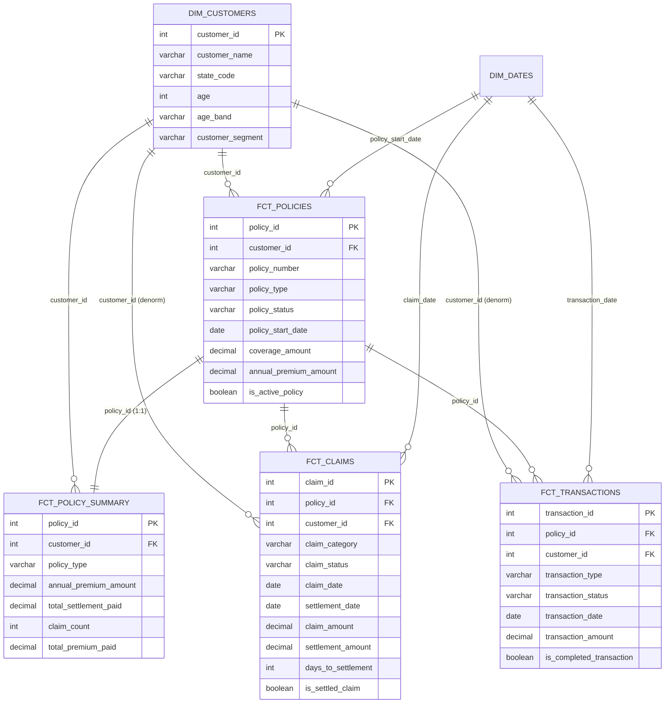

# Insurance Semantic Layer

An end-to-end semantic layer built on insurance data using **dbt + DuckDB + MetricFlow**.

The project delivers:

- A star-schema dimensional model
- A seed-based local raw data layer
- Staging and mart transformations
- A governed semantic layer
- Data quality tests
- Sample queries for the core business questions

The project answers the three main business questions from the take-home:

1. What is our loss ratio by policy type?
2. How many active policies do we have?
3. What is the average time to claim settlement?

---

## 1. Business Goal

The goal of this project is to help insurance business analysts answer underwriting and claims questions without writing SQL.

The semantic layer provides consistent and discoverable definitions for core insurance metrics such as:

- Loss ratio
- Active policies
- Total annual premium
- Claim count
- Average claim settlement time

The sample questions were used as anchor use cases, but the model is designed to support broader self-service analysis across policy type, customer segment, state, claim status, and claim category.

---

## 2. Solution Summary

I built a local analytics project using **dbt and DuckDB**.

The raw CSV files are loaded using **dbt seeds** into a `raw` schema. From there, dbt staging models create typed 1:1 views, mart models create the dimensional model, and MetricFlow semantic YAML exposes governed metrics for self-service analytics.

High-level flow:

```text
seeds/*.csv
    ↓ dbt seed
raw.raw_*
    ↓ dbt run
staging.stg_*
    ↓ dbt run
marts.dim_* / marts.fct_*
    ↓ MetricFlow YAML
semantic layer
    ↓
self-service analytics
```

I chose a dbt-native semantic layer because it keeps transformation logic, metric definitions, tests, and documentation version-controlled in one project.

---

## 3. Dataset Overview

| Seed File | Raw Table | Description | Grain |
|---|---|---|---|
| `raw_customers_2hr.csv` | `raw.raw_customers_2hr` | Customer master data | One row per customer |
| `raw_policies_2hr.csv` | `raw.raw_policies_2hr` | Insurance policy details | One row per policy |
| `raw_claims_2hr.csv` | `raw.raw_claims_2hr` | Insurance claims history | One row per claim |
| `raw_transactions_2hr.csv` | `raw.raw_transactions_2hr` | Premium payments and adjustments | One row per transaction |

Core relationship pattern:

```text
Customer → Policies
Policy → Claims
Policy → Transactions
```

---

## 4. Key Assumptions

The source data is intentionally small, so I made reasonable assumptions to close gaps:

- A customer can have many policies.
- A policy belongs to one customer.
- A policy can have many claims.
- A policy can have many premium transactions.
- Completed premium transactions represent collected premium.
- Completed adjustments are included in net premium collected.
- Settled claims contribute to settlement amount.
- Active policies are identified using policy status.
- **Loss ratio is calculated as settled claim amount divided by written (contractual annual) premium**, not cash premium collected. I tested both: cash-collected premium in this sample data sums to 1.5x-3x the policy's annual premium for most policies, which looks like an artifact of how the seed data was generated rather than a real earnings signal. Written premium is stable, auditable, and tied 1:1 to the policy contract, so I used it as the denominator. In production, I would confirm the official loss ratio denominator with Finance, since companies may use written premium, earned premium, or collected premium depending on the reporting use case.

---

## 5. Architecture


The project follows the requested two-layer dbt model design:

- `staging`: clean, rename, cast, and standardize raw seed tables
- `marts`: create business-ready facts, dimensions, and reporting marts

No intermediate layer was added because the assignment asked for staging and marts only.

---

## 6. Dimensional Model

The mart layer is designed around clear business grains.

| Model | Type | Grain | Purpose |
|---|---|---|---|
| `dim_customers` | Dimension | One row per customer | Customer attributes such as state, age band, and customer segment |
| `dim_dates` | Dimension | One row per calendar day | Shared date spine for time-based analysis |
| `fct_policies` | Fact | One row per policy | Policy attributes and policy-level measures |
| `fct_claims` | Fact | One row per claim | Claim-level analysis and settlement timing |
| `fct_transactions` | Fact | One row per transaction | Premium payment and adjustment analysis |
| `fct_policy_summary` | Reporting fact | One row per policy | Safe policy-level KPI analysis |

### Entity-relationship diagram



### Key Design Decision: Policy-Grain Summary Fact

Claims and transactions are both many-to-one with policies.

If claims and transactions are joined directly, one policy with multiple claims and multiple transactions can create row multiplication. That can inflate premium, claim, and settlement metrics.

To avoid this, I created `fct_policy_summary` at one row per policy.

Claims are aggregated to policy grain first.
Transactions are aggregated to policy grain first.
Then the policy-level metrics are calculated safely.

This makes metrics like loss ratio reliable for self-service analytics.

---

## 7. dbt Transformation Design

### Seed Layer

The project uses dbt seeds to load the four raw CSV files into DuckDB.

Seed files live in:

```text
seeds/
  raw_customers_2hr.csv
  raw_policies_2hr.csv
  raw_claims_2hr.csv
  raw_transactions_2hr.csv
```

Running `dbt build` loads these files into the `raw` schema before building downstream models.

You can also run the seed step separately:

```bash
dbt seed
```

### Staging Layer

The staging layer prepares the raw seed tables for modeling.

Staging models:

- `stg_customers`
- `stg_policies`
- `stg_claims`
- `stg_transactions`

Staging work includes:

- Renaming columns into consistent snake_case names
- Casting date fields
- Casting amount fields
- Standardizing status fields
- Keeping one staging model per raw source
- Preserving the same grain as the raw table

### Mart Layer

The mart layer creates business-ready models for analytics.

Mart models:

- `dim_customers`
- `dim_dates`
- `fct_policies`
- `fct_claims`
- `fct_transactions`
- `fct_policy_summary`

The mart layer is the foundation for the semantic layer.

---

## 8. Semantic Layer Design

The semantic layer is defined using MetricFlow semantic YAML in `models/semantic/`.

It exposes **2 semantic models** and **8 metrics** on top of curated dbt mart models. Metric definitions live in `metrics.yml` with business-facing descriptions; `sem_policies.yml` and `sem_claims.yml` define dimensions and measures.

The semantic layer answers the three required sample questions and supports related follow-up analysis.

### Semantic Models

| Semantic Model | Based On | Grain | Purpose |
|---|---|---|---|
| `policies` | `fct_policy_summary` | One row per policy | Policy, premium, and loss ratio metrics |
| `claims` | `fct_claims` | One row per claim | Claim volume and settlement timing metrics |

### Metrics

Business definitions match `models/semantic/metrics.yml`:

| Metric | Business Definition |
|---|---|
| `policy_count` | Total number of insurance policies in the book of business |
| `active_policies` | Number of policies currently in force (status = Active) |
| `claim_count` | Total number of claims filed against policies |
| `settled_claims` | Number of claims that have been settled and paid out |
| `total_annual_premium` | Total written annual premium — contractual premium, not cash collected |
| `total_settlement_amount` | Total dollars paid out to policyholders to settle claims |
| `average_time_to_claim_settlement` | Average calendar days from claim filing to settlement, settled claims only |
| `loss_ratio` | Claim settlements paid divided by written annual premium |

### Common Dimensions

Analysts can slice metrics by:

- Policy type
- Policy status
- State
- Customer segment
- Age band
- Claim status
- Claim category
- Policy start date
- Claim date
- Settlement date

Example self-service queries:

```text
loss_ratio by policy_type
active_policies by state
claim_count by claim_category
average_time_to_claim_settlement by policy_type
total_annual_premium by customer_segment
```

---

## 9. Answering the Business Questions

Verified output from a fresh `dbt build` on the shipped seed data.

### Question 1: What is our loss ratio by policy type?

Metric: `loss_ratio`
Dimension: `policy_type`

Definition:

```text
loss_ratio = total_settlement_amount / total_annual_premium
```

This metric is calculated from the policy-grain summary model to avoid fanout between claims and transactions.

```bash
$ mf query --metrics loss_ratio --group-by policy__policy_type

policy_type    loss_ratio
-----------  ------------
Auto             89.9487
Home              9
Life              6.33333
```

Raw-SQL equivalent (produces identical numbers): [`analyses/q1_loss_ratio_by_policy_type.sql`](analyses/q1_loss_ratio_by_policy_type.sql)

> The absolute values are unrealistic (the seed CSVs are toy demo data). The queries are arithmetically correct; MetricFlow handles the joins so fan-out bugs are impossible.

### Question 2: How many active policies do we have?

Metric: `active_policies`
Optional dimensions: `policy_type`, `state`, `customer_segment`, `age_band`

Definition:

```text
active_policies = count of policies where policy status is active
```

**Answer: 7 active policies** (out of 8 total). Query: [`analyses/q2_active_policy_count.sql`](analyses/q2_active_policy_count.sql)

### Question 3: What is the average time to claim settlement?

Metric: `average_time_to_claim_settlement`
Optional dimensions: `claim_category`, `claim_status`, `policy_type`, `state`

Definition:

```text
average_time_to_claim_settlement = average days between claim_date and settlement_date for settled claims
```

**Answer: 41.6 days**, across 10 settled claims (2 are still unsettled). Query: [`analyses/q3_avg_days_to_settlement.sql`](analyses/q3_avg_days_to_settlement.sql)

### Bonus: Customer 360 view

[`analyses/q4_customer_360_view.sql`](analyses/q4_customer_360_view.sql) rolls up policies, claims, and transactions per customer. Not a required take-home question, but shows how the star schema supports ad hoc reporting beyond the semantic layer metrics.

---

## 10. Data Quality Tests

The project includes 94 data tests to protect the assumptions behind the semantic layer, spanning sources, staging, and marts.

| Test Type | Count | Example |
|---|---|---|
| Not null | 54 | `customer_id`, `policy_id`, `claim_id`, `transaction_id` |
| Unique | 21 | Primary keys and business keys in dimensions and facts |
| Relationships | 12 | Claims and transactions must link to valid policies |
| Accepted values | 1 | `dim_customers.age_band` |
| Business rules (`expression_is_true`) | 6 | Non-negative amounts; settlement date must not precede claim date |

These tests help ensure that certified metrics remain reliable for self-service analytics. `dbt build` runs 108 total checks (94 tests + 6 table builds + 4 seeds + 4 views), all passing.

Run just the tests:

```bash
dbt test                              # all 94 tests
dbt test --select "source:*"          # source-level tests
dbt test --select staging             # tests on stg_ models
dbt test --select marts               # tests on dim_/fct_ models
```

---

## 11. How to Run the Project

From the repo root:

```bash
cd insurance_semantic_layer
```

Install dbt package dependencies:

```bash
dbt deps
```

Build seeds, models, semantic definitions, and tests:

```bash
dbt build
```

`dbt build` will:

- Load CSV files from `seeds/` into DuckDB
- Build staging models
- Build mart models
- Validate semantic YAML
- Run data tests

Optional: run each step separately:

```bash
dbt seed
dbt run
dbt test
```

Generate dbt docs:

```bash
dbt docs generate
dbt docs serve
```

The project includes a `profiles.yml`, so no manual `~/.dbt/profiles.yml` setup is required.

---

## 12. Project Structure

```text
insurance_semantic_layer/
├── README.md
├── dbt_project.yml
├── packages.yml
├── profiles.yml
├── seeds/
│   ├── raw_customers_2hr.csv
│   ├── raw_policies_2hr.csv
│   ├── raw_claims_2hr.csv
│   └── raw_transactions_2hr.csv
├── macros/
│   └── generate_schema_name.sql
├── models/
│   ├── staging/
│   │   ├── _insurance__sources.yml
│   │   ├── _stg_insurance__models.yml
│   │   ├── stg_customers.sql
│   │   ├── stg_policies.sql
│   │   ├── stg_claims.sql
│   │   └── stg_transactions.sql
│   ├── marts/
│   │   ├── _marts__models.yml
│   │   ├── dim_customers.sql
│   │   ├── dim_dates.sql
│   │   ├── fct_policies.sql
│   │   ├── fct_claims.sql
│   │   ├── fct_transactions.sql
│   │   └── fct_policy_summary.sql
│   └── semantic/
│       ├── sem_policies.yml
│       ├── sem_claims.yml
│       └── metrics.yml
├── analyses/
│   ├── q1_loss_ratio_by_policy_type.sql
│   ├── q2_active_policy_count.sql
│   ├── q3_avg_days_to_settlement.sql
│   └── q4_customer_360_view.sql
└── dev.duckdb
```

---

## 13. Querying with MetricFlow

After `dbt build`, MetricFlow can query the governed metrics.

Examples:

```bash
mf query --metrics loss_ratio --group-by policy__policy_type

mf query --metrics active_policies

mf query --metrics active_policies --group-by policy__state_code

mf query --metrics average_time_to_claim_settlement

mf query --metrics average_time_to_claim_settlement --group-by claim__claim_category

mf list metrics
mf list dimensions --metrics loss_ratio
```

The SQL examples in the `analyses/` folder provide raw SQL equivalents for the main business questions.

---

## 14. Production Considerations

This project is intentionally scoped as a lightweight local implementation.

In production, I would add:

- CI/CD validation on pull requests
- Source freshness checks once seeds are replaced by real upstream sources
- Model contracts
- Metric ownership and certification
- Environment promotion from dev to staging to production
- Observability and alerting
- Access controls and row-level security
- Data lineage and catalog integration
- Semantic-layer usage monitoring
- Automated documentation publishing
- Incremental processing for high-volume facts

In a production system, the dbt seed layer would likely be replaced by a governed ingestion process such as cloud storage, Fivetran, Airbyte, ADF, Databricks, or warehouse-native external tables.

---

## 15. Presentation Summary

The most important design decision was creating a policy-grain summary fact table.

That model prevents fanout between claims and transactions and gives analysts a safe foundation for metrics like loss ratio, active policies, premium, claim count, and settlement amount.

The semantic layer then exposes those metrics with business-friendly dimensions so analysts can answer the required questions and explore related underwriting and claims trends without writing SQL.

The raw CSV files are loaded as dbt seeds, which keeps the project simple, reproducible, and easy to run locally for a take-home assignment.
